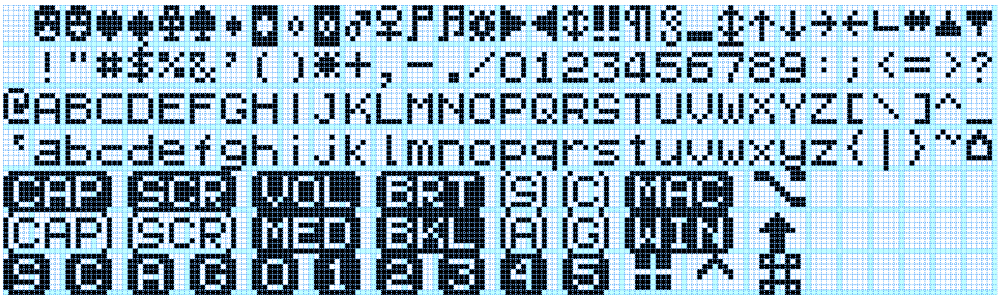

# QSPLIT
I want a split keyboard like quefrency but with oled display and rotary encoder just like satisfaction75. Since I want to reduce the cost to build this keyboard, I use full acrylic with the case and plate.

## Hardware
| Component                                                      | qty | price       | link                                                                                                                          | total Price |
|----------------------------------------------------------------|-----|-------------|-------------------------------------------------------------------------------------------------------------------------------|-------------|
| Acrylic case and plate                                         | 1   | Rp. 148.000 | https://www.tokopedia.com/acrylicsolo/custom-cutting-lasercut-acrylic-akrilik-3mm-murah-berkualitas                           | Rp. 148.000 |
| 120 Secondhand gateron brown                                   | 1   | Rp. 330.000 | -                                                                                                                             | Rp. 330.000 |
| 30 Ws2812B LED RGB                                             | 1   | Rp. 31.616  | https://shopee.co.id/product/59604415/4939222643                                                                              | Rp. 31.616  |
| Oled Lcd 128x32 0.91 inch I2C 12832                            | 1   | Rp. 33.744  | https://shopee.co.id/product/170081862/5022580326                                                                             | Rp. 33.744  |
| 100PCS Self Adhesive Rubber Feet                               | 1   | Rp. 13.178  | https://shopee.co.id/product/141603612/4619155961                                                                             | Rp. 13.178  |
| Adapter Converter Type-C Female to Micro USB Male              | 2   | Rp. 10.146  | https://shopee.co.id/product/167281669/3915263052                                                                             | Rp. 20.292  |
| Carbon keycap 104+21 laser engraved Oem Profile Pbt                 | 1   | Rp. 402.691 | https://shopee.co.id/product/274610761/7244255012                                                                             | Rp. 402.691 |
| 100pcs m2x25mm screw                                           | 1   | Rp. 15.000  | -                                                                                                                             | Rp. 15.000  |
| 500pcs m2 nut                                                  | 1   | Rp. 20.000  | -                                                                                                                             | Rp. 20.000  |
| Magnet Neodymium Kotak 20x10x2mm                               | 10  | Rp. 2.200   | https://shopee.co.id/product/2654850/6002597796                                                                               | Rp. 20.200  |
| Pro Micro ATmega32U4 5V 16MHz                                  | 2   | Rp. 52.141  | https://shopee.co.id/product/63841863/1693666309                                                                              | Rp. 104.282 |
| 4 Pole 3.5mm Stereo Headphone Male Plug Jack Audio             | 2   | Rp. 8.778   | https://shopee.co.id/product/170081862/2774782378                                                                             | Rp. 17.556  |
| 4pcs Metal Electric Bass Guitar Volume Tone Control Knobs Dome | 1   | Rp. 32.718  | https://shopee.co.id/product/272832419/6939803069                                                                             | Rp. 32.718  |
| GENUINE CHERRY PLATE MOUNT STABILIZERS FULLSIZE                | 1   | Rp. 210.000 | https://www.tokopedia.com/pixlup/genuine-cherry-plate-mount-stabilizers-stabilizer-fullsize                                   | Rp. 210.000 |
| 1N4148 Fast Switching Diodes                                   | 150 | Rp. 100     | https://shopee.co.id/product/52086903/5615237668                                                                              | Rp. 15.000  |
| Wire Stripper                                                  | 1   | Rp. 2.700   | https://shopee.co.id/product/52086903/5632591758                                                                              | Rp. 2.700   |
| Push button tact switch micro push button                      | 4   | Rp. 250     | https://shopee.co.id/product/52086903/4505572456                                                                              | Rp. 1.000   |
| 40meter 0.5mm copper wire                                      | 1   | Rp. 32.500  | https://shopee.co.id/product/5773957/167997845                                                                                | Rp. 32.500  |
| Rotary encoder with switch EC11                                | 1   | Rp. 4.617   | https://shopee.co.id/GHID-2PCS-Rotary-encoder-with-switch-EC11-Audio-digital-potentiometer-handle-20mm-i.170081862.2774808434 | Rp. 4.617   |
| 5pcs trrs female pcb                                           | 1   | Rp. 19.339  | https://shopee.co.id/5pcs-Papan-Modul-Ekstensi-Jack-3.5mm-Untuk-Headset-Stereo-i.162080891.4234853478                         | Rp. 19.339  |
|Total Price                                                                                                                      | | |         |Rp. 1.474.433|


## Features
### Rotary encoder
the encoder have layers, you can change it to media layer, scrolling layer, backlit layer and brightness layer. To change encoder layer,simply press `fn1+encoder`. to change base layer like qwerty and so on use `fn2+encoder`.
#### Media layer
in media layer when you press the encoder it is a toogle button play pause `KC_MPLY`. when you turn the encoder clockwise and cc, it is acting as volume up and down (`KC_VOLU`,`KC_VOLD`). but when you turn the encoder while holding fn1 or fn2 it is acting as next and previous/fast forward and rewind button. my idea is awesome right? haha. explaining it in my non native lang is hard, just see my code.

```c
void handle_encoder_switch(void){
    if(ENCODER_MODE == media){
        tap_code(KC_MPLY);
    }
    ...
}
void handle_encoder_media(bool clockwise, bool fn1, bool fn2){
    if(clockwise){
        if(fn1){
            tap_code(KC_MNXT);
        }else if(fn2){
            tap_code(KC_MFFD);
        }else{
            tap_code(KC_VOLU);
        }
    }else {
        if(fn1){
            tap_code(KC_MPRV);
        }else if(fn2){
            tap_code(KC_MRWD);
        }else{
            tap_code(KC_VOLD);
        }
    }
}
```

#### Backlit layer
the idea is the same as media layer, when in this layer, the encoder button will act as ... just see my code
```c
void handle_encoder_switch(void){
    ...
    else if(ENCODER_MODE == backlit) {
        rgblight_step();
    }
    ...
}
void handle_encoder_backlit(bool clockwise, bool fn1, bool fn2){
    if(clockwise){
        if(fn1){
            rgblight_increase_hue();
        }else if(fn2){
            rgblight_increase_sat();
        }else{
            rgblight_increase_val();
        }
    }else {
        if(fn1){
            rgblight_decrease_hue();
        }else if(fn2){
            rgblight_decrease_sat();
        }else{
            rgblight_decrease_val();
        }
    }
}
```
#### Brightness layer
it is just brighness nothing else

### Scroll layer
```c
void handle_encoder_scroll(bool clockwise, bool fn1, bool fn2){
    if(clockwise){
        if(fn1){
            tap_code(KC_WH_R);
        }else if(fn2){
            tap_code(KC_WH_R);
        }else{
            tap_code(KC_WH_D);
        }
    }else {
        if(fn1){
            tap_code(KC_WH_L);
        }else if(fn2){
            tap_code(KC_WH_L);
        }else{
            tap_code(KC_WH_U);
        }
    }
}
```

### 128x32 Oled display
I want the same firmware as satisfaction75 the oled display is awesome, but I can't. So I use font image

edit font using https://helixfonteditor.netlify.app/

### 22 WS2812 RGB lightning (11 each halves)
nothing awesome about this

### Base layer
The base layer is just switching between qwerty mac and qwerty windows by pressing `fn2+encoder`, I can add another like dvorak colemak and etc but I don't want to learn them.

## Layout


## Finished Build


## Wiring

communication protocol is serial using D3 pin, the LED Din pin use B5 pin, the right halve encoder connected to the i2c pin D1 and D0 so I have to disable the oled driver on the right halve to use encoder, and I can't use the Oled display if the right side is the master, always use left as master.

there is only 1 pin left, B5. I intend to use it for buzzer but the maximum size of pro micro firmware not allow me to add this feature :'(.

## Build Log
This is my first custom keyboard and it is a handwired. I am too excited to finish this keeb ASAP so I don't document my build. but here are some pictures of my build without timestamp.

### Acrylic case arrive
trying the switch on the double layer plate acrylic (1.5mm+3mm). It is fit and click without adding some glue. the doubleplate acrylic idea by @dayatz


### Starting build
at first it looks good


adding the pro micro, trrs, led and etc. Disgusting wiring.


this is suppose to be underglow


I trust my ability so no need to test it on breadboard.


