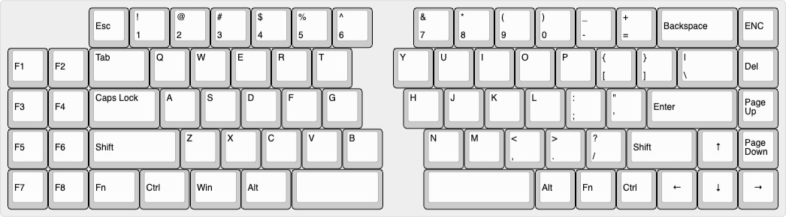
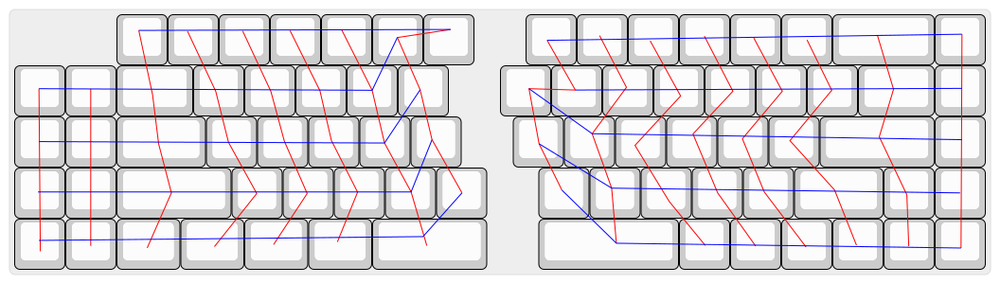

# QSPLIT
I want a split keyboard like quefrency but with oled display and rotary encoder just like satisfaction75. Since I want to reduce the cost to build this keyboard, I use full acrylic with the case and plate.

## Feature
- Rotary encoder
- 128x32 oled display
- 22 WS2812 RGB lightning (11 each halves)

## Layout

## Finished Build

## Wiring
